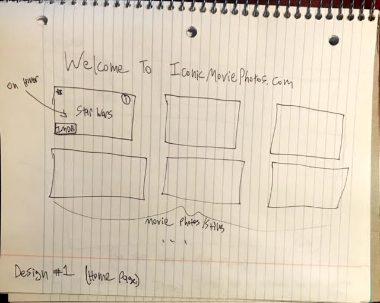
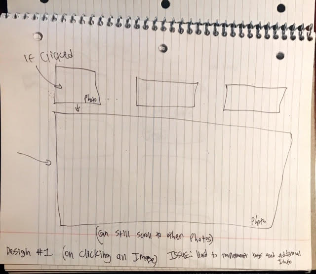
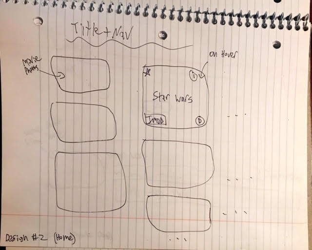
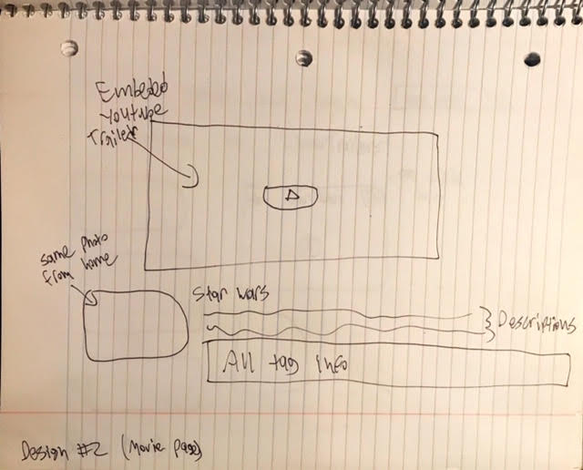
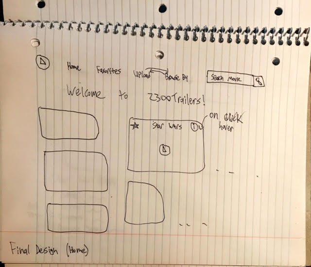
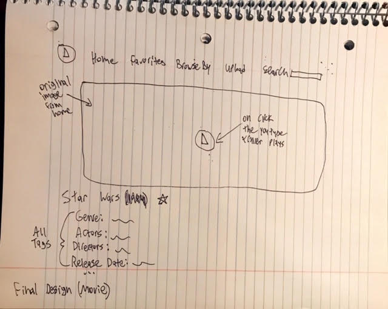
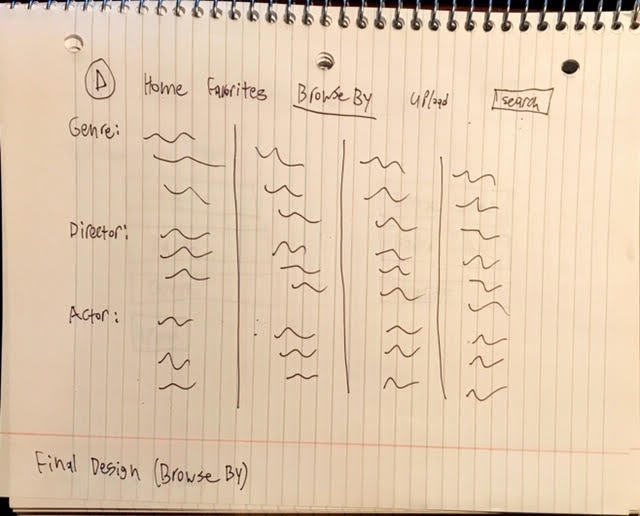
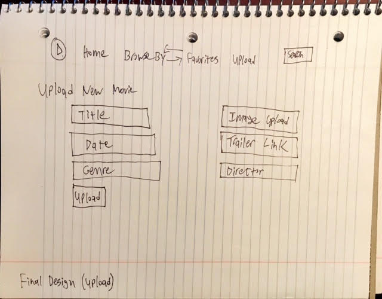

# Project 3: Design Journey

Be clear and concise in your writing. Bullets points are encouraged.

**Everything, including images, must be visible in VS Code's Markdown Preview.** If it's not visible in Markdown Preview, then we won't grade it.

# Design & Plan (Milestone 1)

## Describe your Gallery (Milestone 1)
> What will your gallery be about? 1 sentence.
- I am making a movie trailer website.

> Will you be using your existing Project 1 or Project 2 site for this project? If yes, which project?
- nope, i'll be making everything from scratch

> If using your existing Project 1 or Project 2, please upload sketches of your final design here.


## Target Audience(s) (Milestone 1)
> Tell us about your target audience(s).
1. People who are interested in movies and who potentially want a nostalgia trip from watching trailers from their favorite movies
2. People who potentially want to find a movie to watch


## Design Process (Milestone 1)
> Document your design process. Show us the evolution of your design from your first idea (sketch) to design you wish to implement (sketch). Show us the process you used to organize content and plan the navigation (card sorting), if applicable.
> Label all images. All labels must be visible in VS Code's Markdown Preview.
> Clearly label the final design.


<br>
- This was my initial design for the movie stills website. After this design and coding a mockup, I decided to display the movie trailer on selection, instead of just the photo as I felt like a gallery layout with movie images was reminiscent of netflix or disney+'s landing page. Also, another issue was that different movies have different aspect ratios, thus, when you have equal width and height gaps between images it can look very wonky if images are different sizes.

<br>
<br>

<br>
-This was my initial vision for what would happen when you clicked on an image: a fullscreen size image would appear so you could experience the image in full detail. I realized that because it does not open a new page for the image, it will be difficult to implement the proper tags.

<br>
<br>
<br>

<br>
-This is the second iteration of my design. The main aesthetic change is that by using the css column system it makes it so that movies with different aspect ratios can be displayed without affecting neighbor images on the same row. (the site I got all my movie photos from was a big inspiration for this: https://film-grab.com/). Something I don't like about this is that the "play" icon is tucked in the bottom right--I need to bring it to the forefront so users know that this is a movie/trailer site.

<br>
<br>

<br>
-This is the second iteration of my movie/image page design. As I now want to display the youtube trailer of the selected movie I decided to place the video in the center of the screen with the image from the gallery view in the bottom left as a label. This is similar to how netflix and other streaming services display their content. Some things I don't like is that the ugly youtube thumbnails are prominently displayed. I want the original movie photo (that I handpicked!) to be at the forefront of this page.

<br>
<br>
<br>
<h2>Final Designs</h2>

<br>
- This is the final design to my home page. It is very similar to the previous design except with an added navbar and title. However, on hover, the play icon is prominently displayed in the middle of the screen. To facilitate this, I have moved the title of the movie to the top of the image and completely removed the imdb icon/feature as I thought it was a bit clunky.

<br>
<br>

<br>
- This is the final design of my movie page. A huge change made is the fact that the original image is now displayed prominently with a play icon in the center of it. I will be using jquery to replace the image with a youtube iframe when the play icon is clicked. In this way, I can keep the original feel of my movie photo idea. I will also be including information about the genre, director, and release date (in the original movie table not in the tags table). And I will use tags to keep tract of all the different Actors.

<br>
<br>

<br>
- This is my design for my browse by page. It is the simplest page in my site and is purposely simple in order to have no confusion for the user. All the tags will have links to the home page using query string parameters. I chose this approach to search tags instead of a filter search type option as I wanted to keep the clean aesthetic of the home page and didn't want to complicate the usability of the search form in the navbar.

<br>
<br>

<br>
- This is my final design for the upload page. The form is designed to only be used by the site admin (I might implement a log in feature if I have time) and is therefore simple is design and usability. I made this choice because the users of the website are not people who are uploading these movies, they are on the site to view trailers. Thus, all the uploading and updating should only be used by the site admin. I will also be using this page to include the update tags and delete movie forms.

## Design Patterns (Milestone 1)
> Explain how your site leverages existing design patterns for image galleries.
> Identify the parts of your design that leverage existing design patterns and justify their usage.
> Most of your site should leverage existing patterns. If not, fully explain why your design is a special case (you need to have a very good reason here to receive full credit).
- My sites home page utilizes a gallery of images. This practice is relatively standard as it allows the user to see all images (in this case images that link to movies) at once.
- Also, when a user hovers over the image, a favorite icon and info icon appears. This is a standard pattern across image galleries so the user immediately knows how to "use" them.
- Finally, when a user selects a movie, the user is displayed with a page that displays the home image in a large format with a big red play icon in the middle. As this is a standard design across video players, the user knows that to play the video, she has to click on the icon. This is magnified by the fact that the play icon scales on hover.


## Requests (Milestone 1)
> Identify and plan each request you will support in your design.
> List each request that you will need (e.g. view image details, view gallery, etc.)
> For each request, specify the request type (GET or POST), how you will initiate the request: (form or query string param URL), and the HTTP parameters necessary for the request.

- Request: Click on movie to view trailer/movie page
  - Type: GET via QSP
  - Params: id _or_ movie_id (movies.id in DB)

- Request: Favoriting a movie by clicking on favorite icon
  - Type: POST via a Form (as it uses user input)
  - Params: id of movie that is being added to favorites
  - Note: will need to be implemented using AJAX

- Request: Search Bar (to search for movie title)
  - Type: Get via a form
  - Params: Search params

- Request: Select all result with a specific actor, genre, or director
  - Type: Get via QSP
  - Params: actors_id, genre, or director_name

- Request: Uploading an image
  - Type: POST via a Form
  - Params: file upload, movie title, file ext, release date, youtube link, genre, director name

- Request: Deleting an image
  - Type: Post via a Form
  - Params: movie_id being deleted

- Request: Updating Actor Tags
  - Type: Post via a Form (as it uses user input)
  - Params: movie_id to update, actor_id to add, actor_name to add, actor to delete


## Database Schema Design (Milestone 1)
> Plan the structure of your database. You may use words or a picture.
> Make sure you include constraints for each field.

> Hint: You probably need `images`, `tags`, and `image_tags` tables.

> Hint: For foreign keys, use the singular name of the table + _id. For example: `image_id` and `tag_id` for the `image_tags` table.

```sql
movies (
id : INTEGER {PK, U, Not, AI}
movie_title : TEXT {Not}
file_ext : TEXT {Not}
release_date : TEXT {Not}
trailer_link: TEXT {Not}
director_name TEXT,
genre TEXT,
favorited INTEGER -- 1 for true and null/0 for false
)

actors(
id : INTEGER {PK, U, Not, AI}
actor_name : TEXT {Not, U}
)

movie_actors(
id : INTEGER {PK, U, Not, AI}
movies_id : INTEGER {Not}
actors_id : INTEGER {Not}
UNIQUE(movies_id, actors_id) --requires (movies_id, actors_id) to be unique. This is used for updating the actor tags while ensuring there are no duplicate entries
)
```


## Database Query Plan (Milestone 1)
> Plan your database queries. You may use natural language, pseudocode, or SQL.
> Using your request plan above, plan all of the queries you need.


```sql
--To Get all Movies:
SELECT * FROM movies


--To Get all Actors:
    SELECT actors.actor_name
    FROM movies LEFT OUTER JOIN movie_actors
    ON movies.id = movie_actors.movies_id
    LEFT OUTER JOIN actors ON movie_actors.actors_id = actors.id
    WHERE movies.id = :movie_id


--To Get all movies with a specific genre/director:
SELECT * FROM movies
WHERE movies.genre = :genre


--To get all movies with a specific actor
    SELECT * FROM movies LEFT OUTER JOIN movie_actors
    ON movies.id = movie_actors.movies_id
    LEFT OUTER JOIN actors ON movie_actors.actors_id = actors.id
    WHERE actors.actor_name = :actor


--To delete an actor (using the actors name)
    DELETE FROM movie_actors
    WHERE movies_id = :movie_id
    AND actors_id = (
                    SELECT id FROM actors
                    WHERE actor_name = :actor_name)"
```


## Code Planning (Milestone 1)
> Plan what top level PHP pages you'll need.
 1. Home gallery page
 2. Individual movie page
 3. Browse By Page
 3. Admin Page

> Plan what partials you'll need.
- The only partial I plan to use is for the navbar which we learned how to use in project 1.

> Plan any PHP code you'll need.

```php
 //print out an individual movie for the home gallery
function print_movie($movie)
{
  //prints out the movie image and will display the favorite icon, info icon, movie title, and play icon on hover
}

//on click of play icon or movie title in gallery home page a QSP executes that sends a get request to the movie.php page
<a href="movie.php?<?php echo http_build_query(array('movies_id' => $movie["id"])); ?>" /a>


//facilitates the display of movie trailer in the movie.php page
function display_trailer{
//when the play button is clicked, replace the original movie image and play icon with a youtube video that autoplays the associated trailer
}

//prints info about movie (director, actor, genre) in movie.php page
funciton print_information{
  //execute necessary sql queries to get information (look up above for queries)

  //escape output using htmlspecialchars()
}

//function that prints all actors out
function print_actors{
  //use sql query to get all the actors
  //use a foreach loop to print out all the individual actors
}

if(//image was uploaded){
  //do all the checks to make sure the image is legit
  //upload the image
}
```
Sorry for all the comments--wasn't exactly sure what to do for this.

# Complete & Polished Website (Final Submission)

## Gallery Step-by-Step Instructions (Final Submission)
> Write step-by-step instructions for the graders.
> For each set of instructions, assume the grader is starting from index.php.

Viewing all images in your gallery:
1. Go to the webiste
2. Click movies in the nav
3. You should see "Viewing All Movies"

View all images for a tag:
1. Click "Browse By" in nav
2. Choose the actor you want to browse by
3. Note: Only the actors were implemented with tags. (not genre and director)

View a single image and all the tags for that image:
1. Go to the desired movie and hover over the image
2. Click on the play button or title
3. You will be redirected to the appropriate page
4. Hint: click the play button to view trailer!
5. All the information will be below the image (including the actor tags)

How to upload a new image:
1. Go to the admin page and "log in"
2. Fill out the form in the "Upload New Movie" section
3. Note: as denoted by the asterisk, the first four inputs are required (which is dictated by client side feedback).
4. Note: Doesn't matter where you source the image from, but, all the seed images were sourced from film-grab.com
5. Note: Just copy and paste the url of a youtube video for the youtube link (it is transformed into the appropriate embed link format using a php function)
6. Note: I have included corrective feedback that is displayed when the user uploads an image that's too big

How to delete an image:
1. Go to the admin page and "log in"
2. Go to the "Delete Movie" form
3. Select the appropriate movie, check the warning, and delete

How to view all tags at once:
1. Go to the "Browse By" page
2. All the actors listed are all the tags
3. Note: this list can alternatively be viewed in the "add existing actor" form in the admin page under "update actors"

How to add a tag to an existing image:
1. Go to the admin page and "log in"
2. Go to the "Update Actor Tags" form
3. Select movie to update
4. Either fill out the "Add Existing Actors" or/and "Add New Actors" inputs and CLICK ADD
5. Click "Update" to submit the form
6. At the top of the page feedback appears for the admin that has a link to the updated movie (so you can check easily!)

How to remove a tag from an existing image:
1. This is similar to above, the same form adds and deletes
2. Go to the admin page and "log in" if not already
3. Go to the "Update Actors Form"
4. Select movie to update
5. For the existing tags, click to X by the name to delete
6. Add other tags as desired (remeber to click add)
7. Click "Update" to submit the form
8. Click the link at the top to check


## Reflection (Final Submission)
> Take this time to reflect on what you learned during this assignment. How have you improved since starting this class?

This website took a ton of time to design and build. I really took my time with this in order to make something that I'm proud of and that looks (imo) awesome.

I think that I've improved a ton in this class especially in terms of learning best practices and proper web development. I didn't take 1300 in the fall but took 2110/2800 so I was comfortable with programming but didn't know all of the best practices and overall web development techniques that were taught.

Overall, this was a fantastic capstone project and learning opportunity and I hope that this is reflected in my submission.

<br>
I would also like to say that I loved how this class was organized and set up and specifically allowed you to figure things out for yourself which in my view really solidifies concepts.

Also THANK YOU to the teaching staff! I'm a TA for another class and I can't imagine how difficult logistically it is to grade and teach a class like this; so, thank you!
